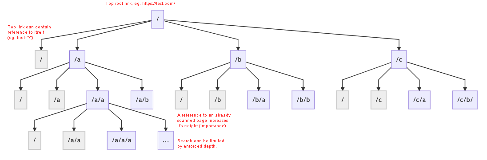

# Breadth-first search with weight scoring
> Simulate HTTP browser link discovery.



Example of a result Map:

```
Map {
  '/' => { visited: true, depth: 0, weight: 5, isMissing: false },
  '/a' => { visited: true, depth: 1, weight: 4, isMissing: false },
  '/b' => { visited: true, depth: 1, weight: 4, isMissing: false },
  '/c' => { visited: true, depth: 1, weight: 4, isMissing: false },
  '/d' => { visited: true, depth: 1, weight: 4, isMissing: false },
  '/b/a' => { visited: false, depth: 2, weight: 0, isMissing: false },
  '/d/a' => { visited: false, depth: 2, weight: 0, isMissing: false },
  '/d/b' => { visited: false, depth: 2, weight: 0, isMissing: false },
  '/d/c' => { visited: false, depth: 2, weight: 0, isMissing: false },
  '/d/d' => { visited: false, depth: 2, weight: 0, isMissing: false } }
```

Example of a result queue Set (aka. non-visited nodes):

```
Set { '/b/a', '/d/a', '/d/b', '/d/c', '/d/d' }
```

#### Install & Run

* `npm install`
* `node build/demo.js` (Demo graph)

#### Development & Testing

* `npm run dev`
* `npm run watch`